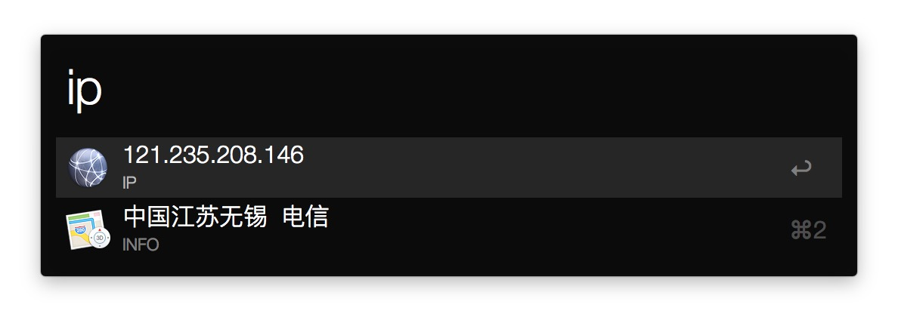
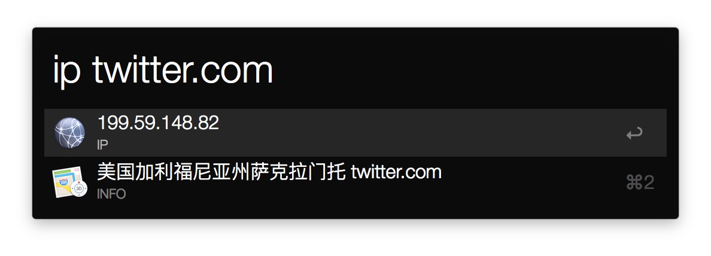
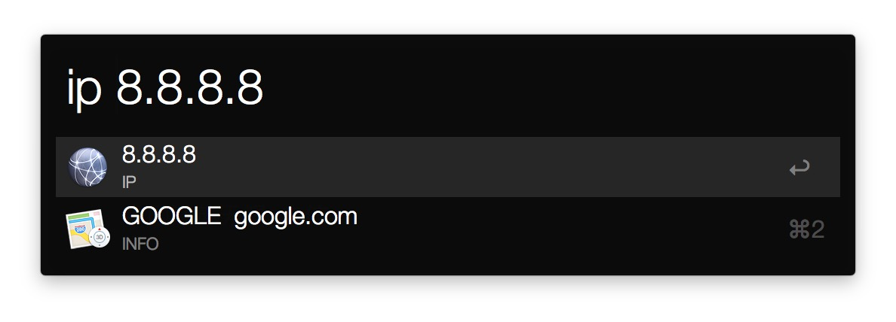

# alfred-workflow-ip-info
一个用于获取 IP 数据的 Alfred Workflow. An Alfred Workflow to get IP info.

## 安装

要求 Node.js `/usr/local/bin/node` 路径正确且版本 >= 6.0.0

在 workflow 的目录下, 执行 `npm i`

## 使用

默认关键词 ip

无参数时, 获取当前 IP 数据

参数为合法的域名或 IP 时, 获取参数的 IP 数据

选择数据, 自动复制到剪贴板

## 截图

